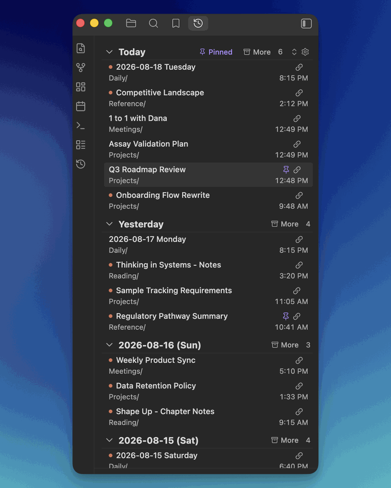

# Recent Edits

A sidebar panel that shows what changed in your vault, grouped by day, with a marker on anything edited from outside Obsidian.



## Why this exists

Most **Recent Files** plugins show recently *opened* files, not recently *modified* ones. As I use my vault together with AI tools, I thought it would be useful to see recently modified files and distinguish between edits I've made in Obsidian and those made through the file system. That matters when you have:

- An external editor or script writing through the filesystem
- AI assistants editing notes via filesystem APIs
- Sync delivering changes you made somewhere else

Recent Edits shows what changed, when it changed, and flags the edits that came from outside Obsidian's editor.

## Install

1. Settings (⌘,) → **Community plugins**
2. If you see "Restricted mode is on", click **Turn on community plugins**
3. **Browse**, search for "Recent Edits", **Install**, then **Enable**
4. Open the panel with the History ribbon icon, or ⌘P → "Recent Edits: Open panel"

Requires Obsidian 1.13.0 or later. Works on desktop and mobile, though copying absolute paths is desktop only.

## Reading the panel

Files are grouped under the calendar day they were last modified, newest day first, newest file first within each day. Days with nothing in them are skipped, so there are no empty headers to scroll past.

Day headers read `Today`, `Yesterday`, then `YYYY-MM-DD (Ddd)`. Click one to collapse or expand that day.

Each row shows the filename, its folder, and the time it was modified:

| What you see | What it means |
|---|---|
| Colored dot before the filename | This edit came from outside Obsidian's editor. Filesystem write, sync, or a plugin. |
| Green or red chevron after the filename | The file grew or shrank substantially since its previous edit. Off by default. |
| Pin icon on the right | The note is pinned. Appears on hover for unpinned notes. |
| Link icon on the right | Copy the file's absolute path to the clipboard. |

The top day header also carries the panel's controls: the **Pinned** pill, the **More** pill for background folders, a day-display toggle, and a gear that opens settings.

## Opening and acting on files

| Action | Result |
|---|---|
| Click a row | Opens the file. Jumps to an existing tab if it's already open, otherwise opens a new one. |
| ⌘/Ctrl-click a row | Always opens in a new tab. |
| Click the link icon | Copies the file's absolute filesystem path. Handy for handing a path to an AI tool or the CLI. Desktop only. |
| Right-click a row | Open in new tab, split, or window. Copy the vault-relative path. Rename, delete, pin, or clear from the list. |
| Hover a row | Shows Obsidian's page preview, if you've turned that on. |

**Clear from list** dismisses a file until its next real edit. Useful when something resurfaces for a reason you don't care about, like a metadata touch or a template re-render. The next genuine edit brings it back on its own.

## Pinned notes

Recent Edits is a running log, so a note you're actively working on slides down and eventually out as other files get touched. Pinning gives those notes a second home without disturbing the log.

A pinned note keeps its normal chronological place in the day groups. It *also* appears in a **Pinned** section that opens from the pill in the top day header. Hover the pill to peek at the list, or click it to hold the section open, which pushes the day list down rather than covering it. Escape releases it.

Pin a note from the pin icon on its row, or from the right-click menu.

Two things worth knowing:

- **Pins ignore your filters.** A pinned note appears in the section even if it lives in an excluded or background folder, or you've cleared it from the list. An explicit pin is a stronger signal than a filter. The day list itself still honors every filter.
- **Pins don't expire.** They outlive the lookback window, so a note you pinned in March is still there in August. Pins only go away when you unpin them or delete the file.

Because pinned notes can span any stretch of time, their rows show a relative stamp rather than a clock time: the time if it was edited today, a weekday name for the past week, and a date beyond that. Hover any stamp for the full timestamp.

## Choosing what shows up

**Lookback days** sets how far back the panel reaches. Seven by default, anywhere from 1 to 90.

**Excluded folders** are hidden outright. Use this for anything you never want in the list. Dot-prefixed folders like `.obsidian` and `.trash` are always excluded regardless.

**Background folders** are hidden by default but recoverable. Each day header gets a **More** pill that reveals them inline, and flips to **Less** to hide them again. This is the right home for folders that churn constantly without being interesting: sync receipts, template backends, daily-note plumbing. They stay out of your way but stay reachable.

Both lists take folder paths with autocomplete from your vault.

## Fitting it to your screen

**Row layout** chooses between two lines per row (filename plus folder path) and one line (filename only). One line fits noticeably more on screen; the full path is still there when you hover the filename.

**Day display** cycles from the toggle in the top day header:

- **Expanded** shows every day open
- **Collapsed** shows just the day headers, so you can see the whole window at once and open what you want
- **Reveal on hover** keeps days collapsed but opens them as you move over them, no clicking

Your choice persists. Clicking an individual day still overrides it for that session.

**File size change indicator** adds a small green or red chevron to rows whose file grew or shrank by more than a threshold you set, 10 KB by default. Below the threshold, nothing shows. It's a quick way to tell a substantial rewrite from a one-line touch without opening the file.

## Settings reference

| Setting | Type | Default | Description |
|---|---|---|---|
| Lookback days | number | `7` | How many days back to include. Range 1 to 90. |
| Row layout | dropdown | Two lines | Two lines shows the folder path under the filename. One line drops it to fit more on screen. |
| External edit indicator color | color | `#D97757` | Color of the dot on externally-edited files. |
| File size change indicator | toggle | off | Show a chevron when a file grew (green) or shrank (red) since its previous edit. |
| Size change threshold (KB) | number | `10` | Minimum change before the indicator appears. Smaller changes are ignored. |
| Copy absolute path affordance | dropdown | Button above the time | Which control copies a row's absolute path: a button, the folder-path text, or both. Desktop only. |
| Hover preview | toggle | off | Show Obsidian's page preview on hover. Requires the Page Preview core plugin. |
| Ignore plugin-declared writes | toggle | on | Leave an entry untouched when a plugin announces its write as housekeeping via `recent-edits:plugin-write`. |
| Background folders | folder list | `[]` | Hidden by default, revealed by the **More** pill. |
| Excluded folders | folder list | `[]` | Hidden completely. |

Settings are grouped into **Row display**, **Behavior**, **Filtering**, and **Support**.

In one-line layout there's no folder-path text to click, so the copy control is always the button no matter what the affordance setting says. Your stored preference is kept and applies again when you switch back to two lines.

## How the external-edit indicator works

The classifier combines a few signals:

- `editor-change` events, which fire when a file is being edited inside Obsidian's editor
- `vault.create` and `vault.modify` events, which fire for any change including writes from outside Obsidian
- `workspace.file-open` events, which catch core-plugin flows that create and open a file, like Daily Notes from the command palette
- File size at create time, since a brand-new empty file is almost always Obsidian creating it from a wikilink click or the New note command

A file is marked as an external edit only when none of those internal signals fire near the create or modify event. Files with no classification yet show no dot.

### Known limitations

Treat the dot as an indicator, not a guarantee. It can be fooled by:

- Edits arriving via Obsidian Sync from another device, particularly when the receiving device was closed at the time of the original edit
- Plugin background writes that never open the file in a workspace leaf, which is rare in practice (a plugin can declare these; see below)
- Files modified before you installed the plugin, which stay unclassified until something touches them again

### Plugin-declared writes

Some plugins rewrite notes as housekeeping: reordering frontmatter keys, inserting scaffold fields, normalizing YAML. Those are not edits, but from the outside they look exactly like one. Recent Edits offers a small contract so a plugin can say so.

Fire this just before writing:

```ts
app.workspace.trigger("recent-edits:plugin-write", { path: file.path });
```

Recent Edits holds the path for five seconds. When the matching `modify` arrives, the entry is left exactly as it was: no time bump, no external-edit dot, no size delta. A note with no recorded edit yet is pinned to its pre-write time so it doesn't surface. Fire it only for writes the user did not ask for on that specific note; a write the user triggered deliberately is an edit and should stay visible.

Controlled by **Ignore plugin-declared writes** in settings, on by default. First adopter: Foldable Frontmatter Groups.

## Support

Recent Edits is free and always will be. If it earns a place in your daily workflow, a coffee helps keep it maintained. There's a link in the plugin's settings too, under **Support**.

<a href='https://ko-fi.com/S6S6Z9TE1' target='_blank'></a>

## License

MIT license. See [LICENSE](LICENSE).
